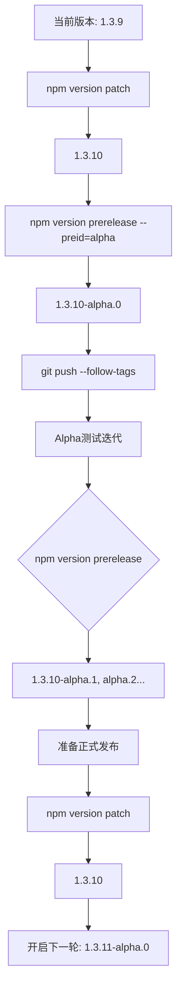

Some notes about the configuration:

-   I changed ACCESS\_TOKEN with GITHUB\_TOKEN because thats what i saw in the documentation. The github token is a token automatically generated by github for each action with the appropiate permissions. Here is the [relevant documentation](https://docs.github.com/en/actions/security-for-github-actions/security-guides/automatic-token-authentication#about-the-github_token-secret)
-   This configuration builds the application and generates a DRAFT release when a new tag is pushed, insteaf of on every push. You can trigger the action manually too. More on that later.
-   Both windows and linux builds get generated. The zip file is the same as the manual release you were currently doing. I did test the windows zip release and encountered no issues. Did not test the .deb or .rpm packages due to a lack of time. I also want to research into packaging as AppImage as that is my prefered linux format.
-   Upgraded the node version to the latest LTS, but feel free to change it if another version is needed for some reason.

Now, this is the easiest way I found to make new releases:

-   After commiting the changes for a new version, run `npm version major|minor|patch` to automatically change the package.json version, and generate the tag. Here is the [npm version documentation.](https://docs.npmjs.com/cli/v6/commands/npm-version). For example, if package version is 1.8.1, and you run `npm version patch`, It will change to 1.8.2. If you run `npm version minor`, it will change to 1.9.0
-   Then, push both the version change and the tag with: `git push --follow-tags`. Of course you can also generate the tags manually.
-   Wait a few minutes to let the actions finish, then you will see the draft release with the artifacts. Just click on the edit button of the draft release to setup the description and discard/add any artifacts.

Let me know if you encounter any issues or want to suggest any change 👍


used most
```
npm version patch
git push --follow-tags
```

for minor changes
```
npm version minor
git push --follow-tags
```

for major changes
```
npm version major
git push --follow-tags
```


creata a fix version
```
npm version 1.3.9-fix3 --allow-same-version --no-git-tag-version
git add package.json
git commit -m "修复版本 1.3.9-fix3"
git tag v1.3.9-fix3
git push origin v1.3.9-fix3 --force
```

---

以下是实现你描述的版本发布流程的 **完整操作指南**，包含命令、原理说明和最佳实践建议：

---

### **版本发布流程与对应命令**
按照你的需求，版本顺序应为：  
`1.3.10-alpha.0` → `1.3.10-alpha.1` → ... → `1.3.10` → `1.3.11-alpha.0` → ...

#### **1. 从 `1.3.9` 开始首次预发布**
```bash
# 1. 确保当前版本是 1.3.9
npm version patch --no-git-tag-version  # 1.3.9 → 1.3.10 (推进到下一修订版)
npm version prerelease --preid=alpha    # 1.3.10 → 1.3.10-alpha.0

# 2. 提交并打标签
git add package.json
git commit -m "Release 1.3.10-alpha.0"
git tag v1.3.10-alpha.0
git push --follow-tags
```

#### **2. 迭代预发布版本（alpha.1, alpha.2...）**
```bash
# 每次迭代只需运行（自动递增预发布序号）：# 1.3.10-alpha.0 → 1.3.10-alpha.1
npm version prerelease --preid=alpha    
git push --follow-tags
```

#### **3. 发布正式版本 `1.3.10`**
```bash
# 移除预发布标识符，生成正式版本
npm version patch --no-git-tag-version  # 1.3.10-alpha.X → 1.3.10
git add package.json
git commit -m "Release 1.3.10"
git tag v1.3.10
git push --follow-tags
```

#### **4. 开启下一轮预发布（1.3.11-alpha.0）**
```bash
# 1. 先推进到下一修订版
npm version patch --no-git-tag-version  # 1.3.10 → 1.3.11

# 2. 添加预发布标识
npm version prerelease --preid=alpha    # 1.3.11 → 1.3.11-alpha.0
git push --follow-tags
```

### **操作流程图**
