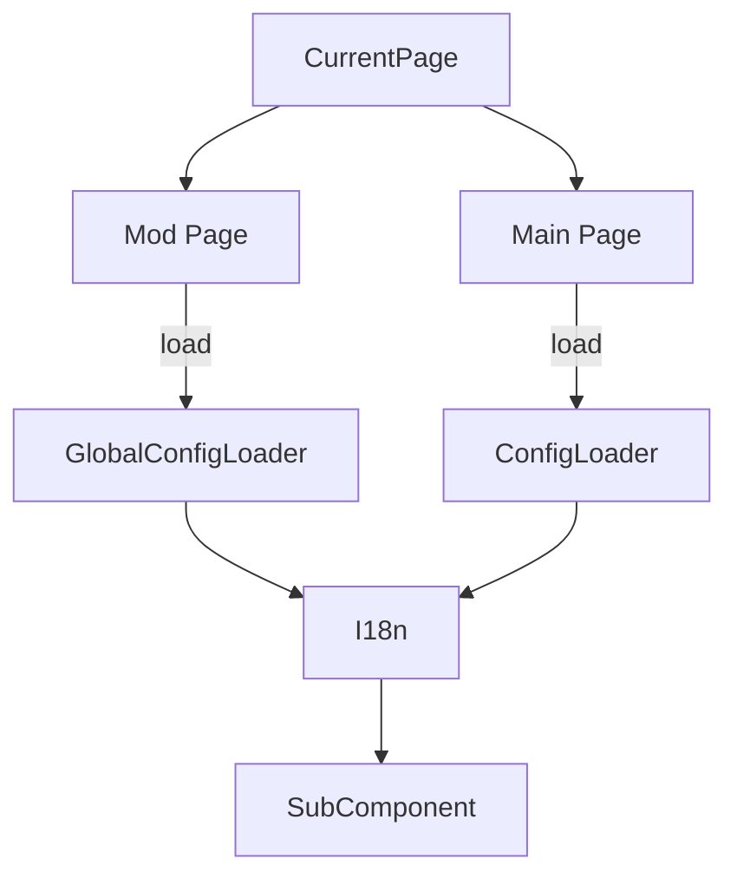

## 现在的问题

### 状态管理混乱

#### 问题阐述

现在的状态管理非常混乱，比如说语言的切换：
- 在 `GlobalConfigLoader` 中有一个 `language` 的配置项。
- 在 `ConfigLoader` 中有一个 `language` 的配置项。
- 在 `I18n` 中有一个 `language` 的状态。

期望的效果是：
其他组件通过 `$t` 来获取语言相关的文本,而不需要关心具体的状态来源,不需要关注语言的切换或者配置的加载。

配置加载跟随页面的切换来更新状态，比如：
- 在 Main Page 时，应该使用的是 `GlobalConfigLoader` 中的配置。
- 在 Mod Page 时，应该使用的是 `ConfigLoader` 中的配置,(此时切换到对应的游戏的配置)

也就是整个逻辑是：

此外 i18n 提供的状态最好要是响应式的，这样才能在页面切换时自动更新。

但是现在问题是，我实现了一个 [RebindableRef](../src/shared/composables/RebindableRef.ts) 来解决这个问题。

但是我发现一个问题，就是使用rebine：

1. 让整个状态管理变得更加混乱了，特别是在不同页面之间切换时，状态的来源变得不明确。
2. 无法使用watchEffect来监听状态的变化，不得不自定义一个watch，但是自定义的watch无法正确地响应状态的变化。
